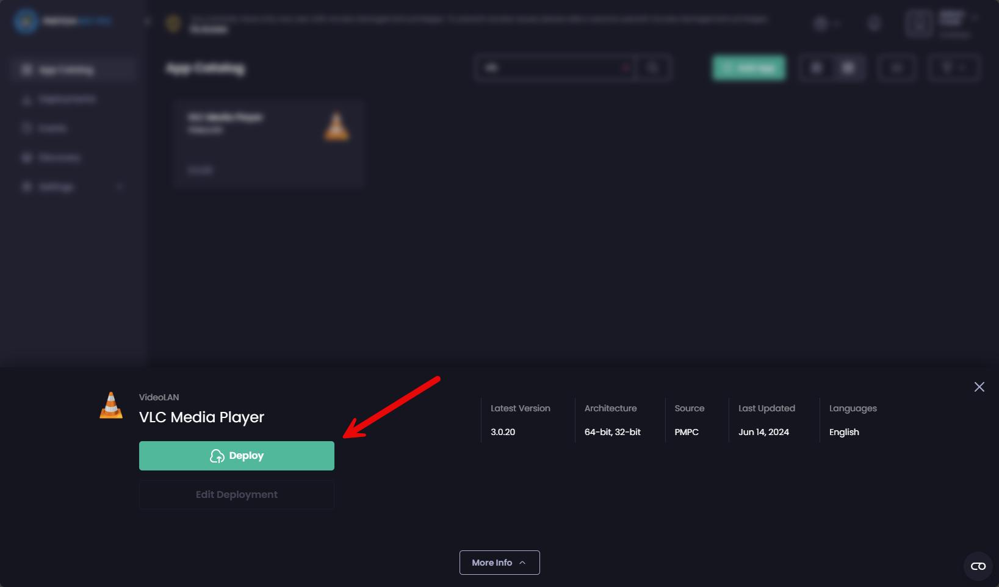
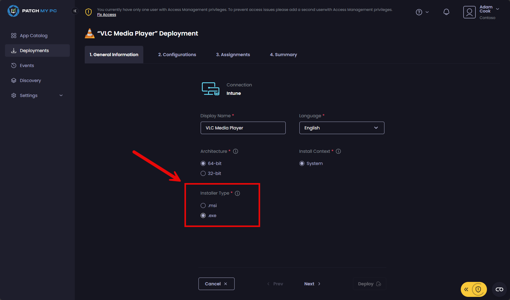
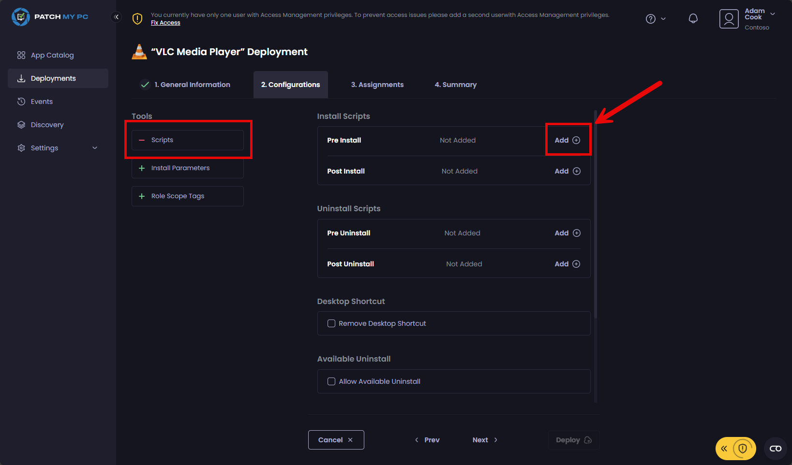
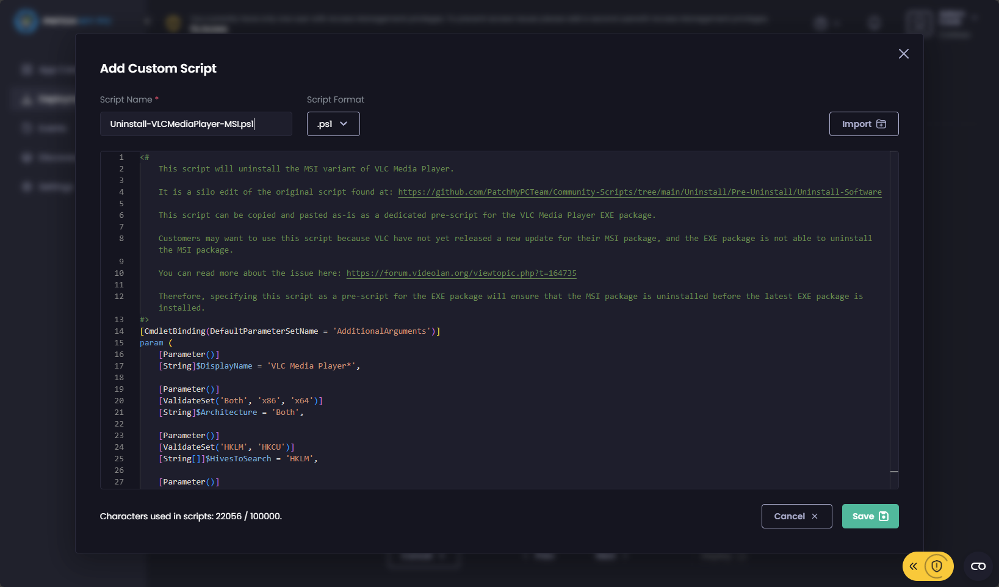
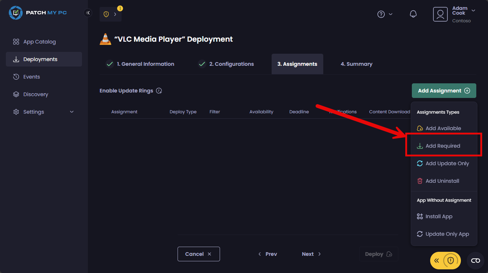

# Uninstall-VLCMediaPlayer-MSI.ps1

The developers for VLC Media Player released a new update 3.0.21 in June 2024. While they released a new .exe installer, they did not release a new .msi installer.

You can read more about it here: https://forum.videolan.org/viewtopic.php?t=164735

At the time of posting this (November 2024), a new .msi is not yet released. Therefore, Uninstall-VLCMediaPlayer-MSI.ps1 is shared here to help customers update VLC Media Player on their endpoints.

The script is intended to be used a pre-script for the latest EXE variant of VLC Media Player. It will silently uninstall the MSI variant of VLC Media Player. As a result, this will help you keep your devices up to date.

## Patch My PC Publisher

This section will guide you through how to add the script using the Patch My PC Publisher, our on-premises product, for both Microsoft Configuration Manager and Intune.

### Configuration Manager

To solve this problem with Configuration Manager, you will need to an Enterprise Plus license with access to the ConfigMgr Apps tab. 

This problem cannot be solved with updates, because updates only apply to the same variant installed on the devices. In other words, deploying the EXE update for devices with MSI installed will result in the update reporting "not applicable".

Therefore, you need to publish and deploy the ConfigMgr App EXE variant of VLC Media Player with this pre-script attached:

1. Download [Uninstall-VLCMediaPlayer-MSI.ps1](Uninstall-VLCMediaPlayer-MSI.ps1)
2. Open the Patch My PC Publisher
3. Navigate to the Config Apps tab
4. Right-click on each of the below products (if enabled)
   - VLC Media Player (x64) - MSI Install
   - VLC Media Player (x86) - MSI Install
5. Choose **Add custom pre/post script**:

6. For **Pre-Script**, browse out and choose **Uninstall-VLCMediaPlayer-MSI.ps1** downloaded from step 1:

7. In the **Sync Schedule** tab, click **Run Publishing Service Sync**
8. Once the sync is complete, the Application in ConfigMgr should then be deployed to a collection of users/devices with the MSI variant of VLC Media Player installed.

### Intune

This problem cannot be solved with Intune Updates, because updates only apply to the same variant installed on the devices. In other words, deploying the EXE update for devices with MSI installed will result in the update reporting "not applicable".

Therefore, you need to publish and deploy the Intune App EXE variant of VLC Media Player with this pre-script attached:

1. Download [Uninstall-VLCMediaPlayer-MSI.ps1](Uninstall-VLCMediaPlayer-MSI.ps1)
2. Open the Patch My PC Publisher
3. Navigate to the Intune Apps tab
4. Right-click on each of the below products (if enabled)
   - VLC Media Player (x64) - MSI Install
   - VLC Media Player (x86) - MSI Install
5. Choose **Add custom pre/post script**:

6. For **Pre-Script**, browse out and choose **Uninstall-VLCMediaPlayer-MSI.ps1** downloaded from step 1:

7. It is recommended to delete any existing Intune App packages in Intune made by the Publisher for VLC Media Player EXE before triggering a sync
8. In the **Sync Schedule** tab, click **Run Publishing Service Sync**
9. Once the sync is complete, the new Intune App for VLC Media Player EXE in Intune should then be deployed to a security group of users/devices with the MSI variant of VLC Media Player installed.

## Patch My PC Cloud

This section will guide you through how to add the script using the Patch My PC Cloud for Microsoft Intune.

### Intune 

This problem cannot be solved with Update Only deployments, because updates only apply to the same variant installed on the devices. In other words, deploying the EXE update for devices with MSI installed will result in the update reporting "not applicable".

Therefore, you need to publish and deploy the Install App as required for the EXE variant of VLC Media Player with this pre-script attached:

1. Download [Uninstall-VLCMediaPlayer-MSI.ps1](Uninstall-VLCMediaPlayer-MSI.ps1)
2. Login to the [Patch My PC Cloud portal](https://portal.patchmypc.com)
3. Browse and begin creating a new deployment for VLC Media Player:

> [!TIP]
> If you already have an EXE deployment for VLC Media Player, feel free to edit that instead. You need not create another one.

4. Change **Installer Type** to .exe and click **Next >**

5. Click **Add** beside **Pre Install**:

6. Click **Import** at the top right and choose **Uninstall-VLCMediaPlayer-MSI.ps1** downloaded from step 1:

7. In the **3. Assignments** stage of the wizard, add a **Required** assignment to your desired security group of users/devices with VLC Media Player MSI installed and complete the deployment wizard through to the end:

> [!IMPORTANT]  
> Do not choose an Update Only assignment, because as mentioned, the update will return as "not applicable" - it must be a required assignment of the Install App package, so be sure to choose the **Required** assignment option.

